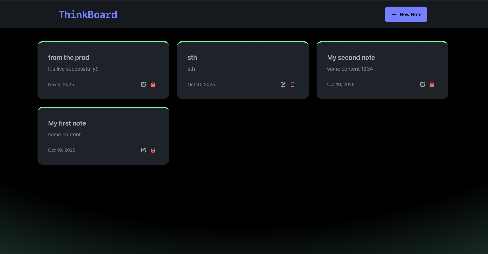
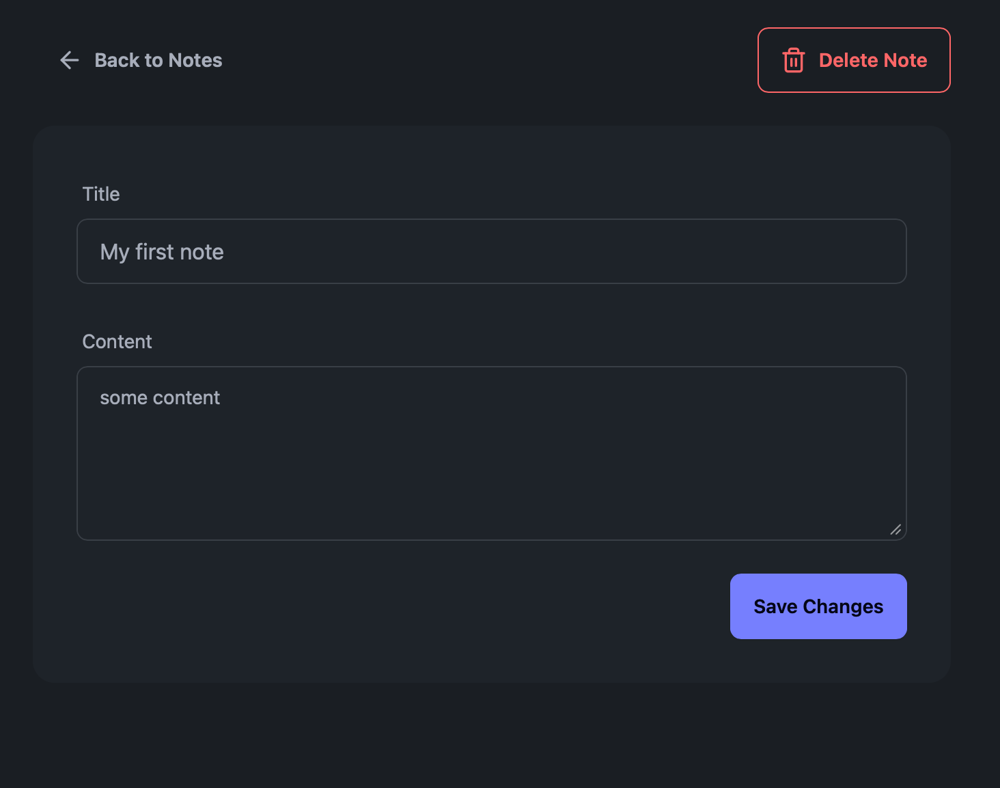
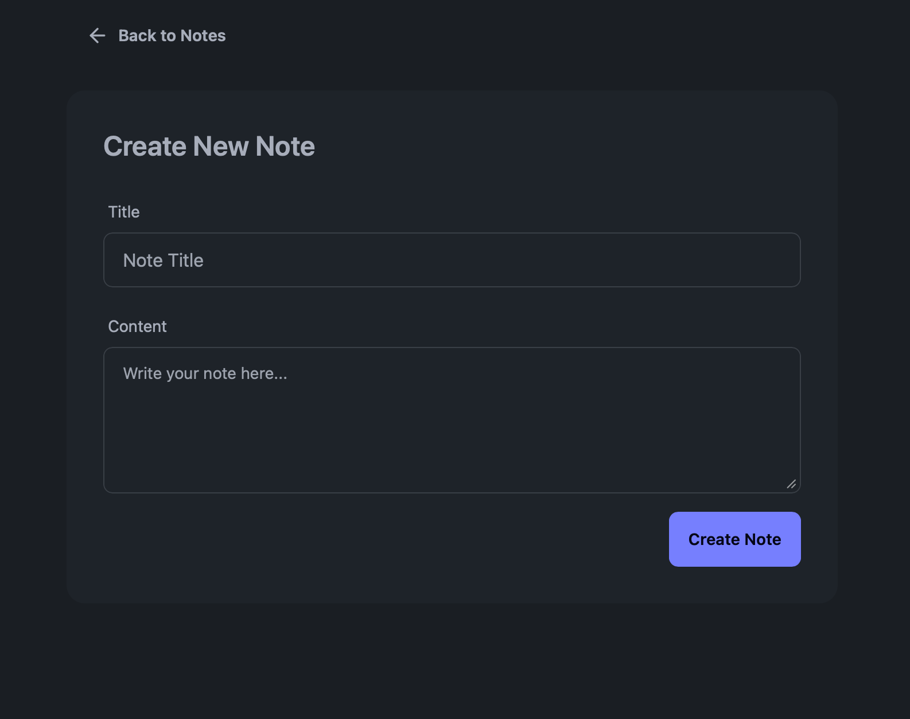
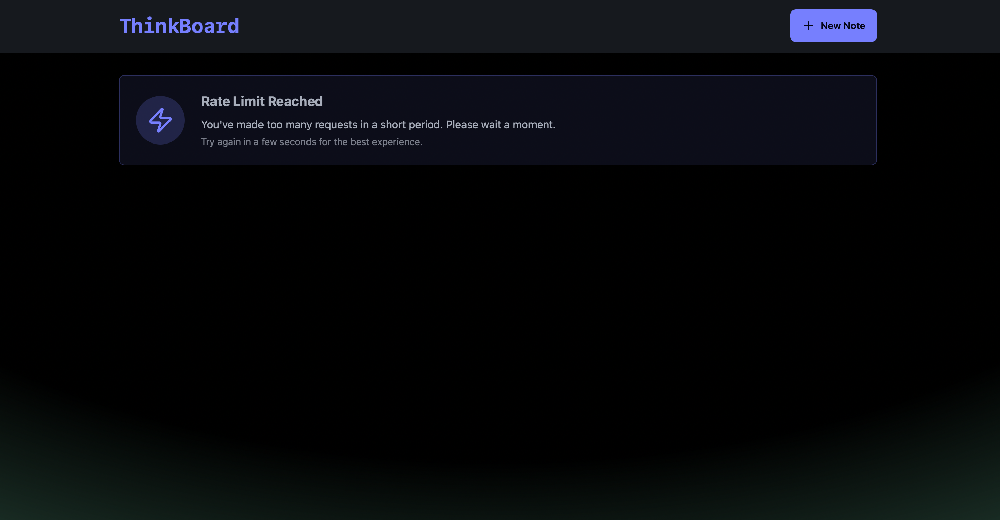

<h1 align="center">🧠 MERN Stack Note Taking App</h1>

## ✨ Highlights

- 🧱 Full-Stack App Built with the MERN Stack (MongoDB, Express, React, Node)
- ✨ Create, Update, and Delete Notes with Title & Description
- 🛠️ Build and Test a Fully Functional REST API
- ⚙️ Rate Limiting with Upstash Redis
- 🚀 Completely Responsive UI
- 🌐 Explore HTTP Methods, Status Codes & SQL vs NoSQL
- 📦 Deployment Ready


## 📸 Screenshots

<p align="center">
    <span style="font-size:14px; margin-top:10px; display:block; font-weight:bold;">🏠 Home Page</span>
    <br>
    
    
</p>
<br>
<table align="center" border="0" cellspacing="20" cellpadding="0">
  <tr>
    <td align="center">
      <span style="font-size:14px; margin-top:10px; display:block; font-weight:bold;">✨ Note Detail Page</span>
    <br>
    
    </td>
    <td align="center">
      <span style="font-size:14px; margin-top:10px; display:block; font-weight:bold;">🗒️ Create Page</span>    
    <br>
    
    </td>
  </tr>
</table>
<br>
<p align="center">
    <span style="font-size:14px; margin-top:10px; display:block; font-weight:bold;">💀 Rate Limit</span>
    <br>
    
</p>

## 🛠️ Tech Stack

| Technology | Description |
|------------|-------------|
| 💻 Frontend | React, JavaScript, Tailwind CSS, Daisy UI |
| ⚙️ Backend  | Node.js, Express.js |
| 🗄️ Database | MongoDB |
| 🧠 State Management | useState, useEffect |
| 🔐 Rate Limiting | Upstash Redis |
| 🔔 Notifications | React Hot Toast |

## 🧪 .env Setup

### Backend (`/backend`)

```
MONGO_URI=<your_mongo_uri>

UPSTASH_REDIS_REST_URL=<your_redis_rest_url>
UPSTASH_REDIS_REST_TOKEN=<your_redis_rest_token>

NODE_ENV=development
```

## 🔧 Run the Backend

```
cd backend
npm install
npm run dev
```

## 💻 Run the Frontend

```
cd frontend
npm install
npm run dev
```

## 🎉 Acknowledgments

Thanks to the following amazing tools and platforms:

- ☁️ [Render](https://render.com) – for deployment  
- 🍃 [MongoDB](https://www.mongodb.com/) – for the database  
- 💨 [Tailwind CSS](https://tailwindcss.com) – for utility-first styling  
- ⚛️ [React](https://reactjs.org) – for the frontend framework  
- ⚡ [Vite](https://vitejs.dev) – for fast frontend tooling  
- 🎨 [DaisyUI](https://daisyui.com) – for styled components built on Tailwind
